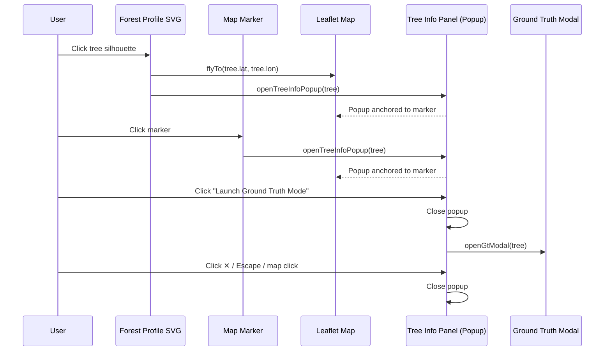

# Design Document: Tree Info Panel

## Overview

The Tree Info Panel replaces the current direct-to-ground-truth flow with an intermediate, map-anchored information panel. When a user clicks a tree (via the forest profile SVG or a map marker), a Leaflet popup-style panel opens anchored to the tree's marker, displaying key tree data (rank, height, error, tier, coordinates). The panel provides an explicit "Launch Ground Truth Mode" button to optionally enter the existing measurement workflow, and a conditional "Fly Back to Tree" button that appears only when the user scrolls the tree out of view.

This decouples tree inspection from measurement, letting users browse tree data without committing to the full ground truth workflow.

## Architecture

The feature is entirely frontend. No backend changes are needed — the `/api/analyze` response already contains all required tree fields (`rank`, `height_m`, `error_m`, `lat`, `lon`, `tier`, `colour`).

### Implementation Approach

Use Leaflet's `L.popup()` with custom HTML content, anchored to the tree's `circleMarker` latlng. Leaflet popups natively provide:
- Anchor stem/pointer to a latlng
- Auto-pan (flyTo) on open
- Close on map click (configurable)
- Close button
- DOM lifecycle (`popupopen` / `popupclose` events)

We override the popup's default styles via a custom CSS class (`tree-info-popup`) to match the app's dark theme, and inject dynamic HTML content for each selected tree.

### Flow



## Components and Interfaces

### 1. `openTreeInfoPopup(tree)`

Main entry point. Replaces the current `openGtModal(tree)` call in `highlightTree()`.

**Parameters:**
- `tree` — object from `window._lastData.trees[]` with fields: `rank`, `height_m`, `error_m`, `lat`, `lon`, `tier`, `colour`, `_marker`

**Behavior:**
1. Close any existing tree info popup
2. Build HTML content string with tree data
3. Create `L.popup` with `className: 'tree-info-popup'`, `maxWidth: 280`, `minWidth: 280`, `closeButton: true`, `autoPan: true`
4. Set popup content and open at `[tree.lat, tree.lon]` on the map
5. Fly map to tree coordinates
6. Set focus on the close button for keyboard accessibility
7. Store reference to current popup and selected tree in `window._treeInfoPopup` and `window._treeInfoTree`

### 2. `closeTreeInfoPopup()`

Closes the active tree info popup and cleans up state.

### 3. `buildTreeInfoHTML(tree)`

Pure function that returns the HTML string for the popup content.

**Sections:**
- Header: rank + height + close handled by Leaflet's built-in close button
- Tier badge (colored with `tree.colour`)
- Data rows: Height (with ± error), Tier, Rank (e.g. "#3 of 147"), Coordinates
- "Launch Ground Truth Mode" button (green accent `#3d8b40`)
- "Fly Back to Tree" button (hidden by default, shown via `moveend` listener)

### 4. `updateFlyBackVisibility()`

Called on Leaflet `moveend` event. Checks if the tree's marker position is within the current map viewport bounds. Shows/hides the "Fly Back to Tree" button accordingly.

### 5. Modified `highlightTree(tree)`

Changed to call `openTreeInfoPopup(tree)` instead of `openGtModal(tree)`. The marker flash animation is retained.

### 6. Modified `refreshUnits()`

Extended to update the tree info popup content if one is currently open, so unit changes are reflected live.

### 7. Escape Key Handler

The existing `keydown` listener for Escape is extended: if a tree info popup is open, close it; otherwise close the GT modal as before.

## Data Models

No new data models. The feature consumes the existing tree object returned by `/api/analyze`:

```js
{
  rank: number,        // 1-based rank by height
  height_m: number,    // canopy height in metres (e.g. 62.4)
  error_m: number,     // mean absolute error (always 2.8)
  lat: number,         // WGS-84 latitude
  lon: number,         // WGS-84 longitude
  tier: string,        // "Global" | "National" | "Regional" | "Tall" | "Common"
  colour: string,      // hex colour for the tier (e.g. "#44bb44")
  _marker: L.CircleMarker  // reference to the Leaflet marker (set client-side)
}
```

The total tree count for "rank of N" display comes from `window._lastData.stats.n_trees`.


## Correctness Properties

*A property is a characteristic or behavior that should hold true across all valid executions of a system — essentially, a formal statement about what the system should do. Properties serve as the bridge between human-readable specifications and machine-verifiable correctness guarantees.*

### Property 1: Panel content completeness

*For any* valid tree object (with rank, height_m, error_m, tier, colour, lat, lon) and any total tree count, the HTML string produced by `buildTreeInfoHTML(tree, totalCount)` SHALL contain:
- The tree's rank and total count in the format "#rank of total"
- The tree's height value (formatted per current unit preference)
- The error margin value
- The tier label
- The tier colour as an inline style or CSS variable
- The tree's lat/lon coordinates
- A "Launch Ground Truth Mode" button with background colour `#3d8b40`

**Validates: Requirements 1.4, 1.5, 1.6, 4.1**

### Property 2: Unit conversion correctness

*For any* tree height in metres and any unit preference (metres or feet), the height string produced by the formatting function SHALL equal the original metre value when units are metres, or the metre value multiplied by 3.28084 when units are feet, both rounded to one decimal place with the appropriate suffix.

**Validates: Requirements 7.1, 7.2**

### Property 3: Fly-back button visibility tracks viewport

*For any* tree latlng and any map viewport bounds, the "Fly Back to Tree" button visibility SHALL be `true` if and only if the tree's latlng is outside the viewport bounds.

**Validates: Requirements 3.1, 3.2, 3.4**

## Error Handling

| Scenario | Handling |
|---|---|
| Tree object missing fields | `buildTreeInfoHTML` uses fallback values: `"—"` for missing numbers, `"Unknown"` for missing tier, empty string for missing coords |
| No analysis data loaded (`window._lastData` is null) | `openTreeInfoPopup` is a no-op; the function returns early |
| Popup fails to open (Leaflet error) | Wrap `popup.openOn(map)` in try/catch; log error to console, no user-facing alert |
| Map flyTo interrupted by user interaction | Leaflet handles this gracefully; the fly-back button visibility updates on every `moveend` regardless |
| Unit change while no popup is open | `refreshUnits` checks for active popup before attempting content update |

## Testing Strategy

### Unit Tests (vitest + jsdom)

Focus on specific examples and edge cases:

- `buildTreeInfoHTML` returns correct HTML for a known tree object (example)
- Close button click removes popup from DOM (example for 2.1)
- Escape key closes popup (example for 2.3 / 8.3)
- Map click closes popup via Leaflet's `closeOnClick` (example for 2.2)
- "Launch Ground Truth Mode" button click closes popup and opens GT modal (example for 4.2)
- Tree selection opens info panel, NOT GT modal (example for 5.1, 5.2)
- Fly-back button is hidden on initial open (example for 3.1)
- Fly-back button click triggers `map.flyTo` (example for 3.3)
- Unit change while popup is open updates content (example for 7.3)
- Close button receives focus on popup open (example for 8.1)
- Tab order includes close, GT button, and fly-back button (example for 8.2)
- No backdrop overlay element is added (example for 6.4)

### Property-Based Tests (fast-check via vitest)

Each property test runs a minimum of 100 iterations with randomly generated inputs.

Each test is tagged with a comment: `Feature: tree-info-modal, Property N: <title>`

- **Property 1 test**: Generate random tree objects (random rank 1–500, random height 2.0–120.0, random error 0.1–10.0, random tier from TIERS, random lat/lon within PNW bounds) and random total counts. Assert `buildTreeInfoHTML` output contains all required fields.
- **Property 2 test**: Generate random height values (0.1–200.0) and random unit preference (boolean). Assert formatted output matches expected conversion.
- **Property 3 test**: Generate random tree latlng and random viewport bounds (as `L.LatLngBounds`). Assert button visibility equals `!bounds.contains(latlng)`.

### E2E Tests (Playwright)

- Click a tree silhouette in the forest profile → verify popup appears on map
- Click a map marker → verify popup appears
- Click "Launch Ground Truth Mode" → verify GT modal opens
- Verify no backdrop overlay is present when popup is open
