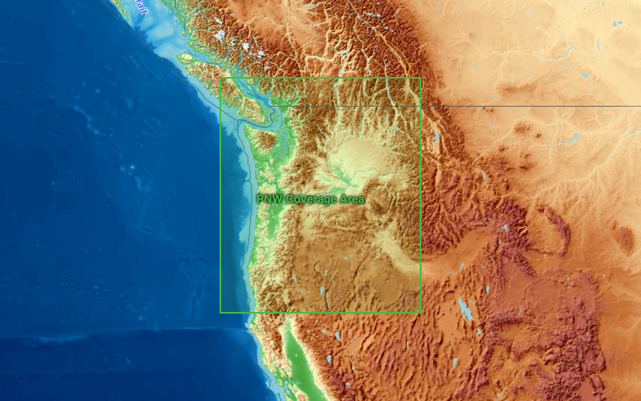

# tallest-tree

PNW Canopy Height Explorer — find and measure the tallest trees in the Pacific Northwest using satellite canopy-height data.

**Live (tailnet):** https://tommys-mac-mini.tail59a169.ts.net/tallest-trees

## Coverage Area



The app analyzes canopy height within the Pacific Northwest bounding box: **41°N–50°N, 126°W–115°W** — covering Washington, Oregon, northern California, Idaho, and western Montana. The coverage boundary is also available as GeoJSON at [`docs/coverage.json`](docs/coverage.json).

## Data Sources

### Meta / World Resources Institute — Global Canopy Height Map

The primary data source is the **High Resolution 1m Global Canopy Height Map** produced by Meta and the World Resources Institute (WRI). The model fuses spaceborne LiDAR measurements from NASA's GEDI mission with optical satellite imagery to produce wall-to-wall canopy height estimates at 1-meter resolution.

- **Resolution:** 1 m/pixel
- **Accuracy:** ±2.8 m mean absolute error (MAE)
- **Coverage:** Global, tiled as zoom-9 QuadKey GeoTIFFs in EPSG:3857 (Web Mercator)
- **Storage:** Public S3 bucket (`dataforgood-fb-data`), no credentials required (`AWS_NO_SIGN_REQUEST=YES`)
- **Tile URL pattern:** `https://dataforgood-fb-data.s3.amazonaws.com/forests/v1/alsgedi_global_v6_float/chm/{quadkey}.tif`
- **Publication:** Tolan et al., "Very high resolution canopy height maps from RGB imagery using self-supervised vision transformer and convolutional decoder trained on aerial lidar" (2024)
- **Metadata & download:** https://registry.opendata.aws/dataforgood-fb-forests/
- **Research paper:** https://doi.org/10.1016/j.rse.2023.113888
- **Meta Data for Good page:** https://dataforgood.facebook.com/dfg/tools/high-resolution-canopy-height-maps

### OpenTopoMap

Base map tiles for terrain visualization.

- **URL:** `https://{s}.tile.opentopomap.org/{z}/{x}/{y}.png`
- **License:** CC-BY-SA, map data from OpenStreetMap contributors
- **Site:** https://opentopomap.org

### NASA GEDI (Underlying LiDAR Reference)

The canopy height model is calibrated against NASA's Global Ecosystem Dynamics Investigation (GEDI) spaceborne LiDAR, which provides reference measurements of forest structure from the International Space Station.

- **Mission page:** https://gedi.umd.edu
- **Data access:** https://lpdaac.usgs.gov/products/gedi02_av002/

## Quick Start

```bash
# Install dependencies
pip install -r requirements.txt
npm install

# Start Flask backend + Vite frontend with Tailscale HTTPS
python server.py &
npm run serve
```

## npm Scripts

| Command | Description |
|---|---|
| `npm run dev` | Vite dev server (localhost only) |
| `npm run serve` | Start Vite in background + expose via Tailscale Serve at `/tallest-trees` |
| `npm run serve:kill` | Stop Vite and remove Tailscale Serve |
| `npm test` | Run vitest unit tests |
| `npm run test:watch` | Run vitest in watch mode |

## Serve Options

`scripts/serve.sh` accepts flags for customization:

```
-p, --port PORT        Vite port (default: 5180)
-t, --no-tailscale     Skip Tailscale Serve
--ts-path PATH         Tailscale serve path (default: /tallest-trees)
-f, --foreground       Run Vite in foreground
-k, --kill             Stop running server and Tailscale serve
```
